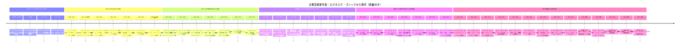

```mermaid
timeline
    title 主要芸術家年表：ロマネスク・ゴシックから現代（詳細付き）

    section ロマネスク・ゴシック期（約1000年〜1400年頃）
        1120年代 - 1130年代 : ギルベルトゥス（フランス / 代表作：「最後の審判」オータン大聖堂、1130年頃 / 現地保存）
        1200年頃 : ヴィリギス・モザイク職人（神聖ローマ帝国 / 代表作：マインツ大聖堂の装飾、1200年頃 / 現地保存）
        1240 - 1302 : アルノルフォ・ディ・カンビオ（イタリア / 代表作：フィレンツェ大聖堂の設計、1296年）
        1267 - 1337 : ジョット・ディ・ボンドーネ（イタリア / 代表作：スクロヴェーニ礼拝堂のフレスコ画、1305年頃）

    section ルネサンス（約1400年〜1600年頃）
        1386 - 1466 : ドナテッロ（イタリア / 代表作：「ダビデ像」、1440年頃 / バルジェロ美術館）
        1401 - 1428年頃 : マサッチオ（イタリア / 代表作：「楽園追放」、1425年頃 / サンタ・マリア・デル・カルミネ教会）
        1445 - 1510 : サンドロ・ボッティチェリ（イタリア / 代表作：「ヴィーナスの誕生」、1485年頃 / ウフィツィ美術館）
        1452 - 1519 : レオナルド・ダ・ヴィンチ（イタリア / 代表作：「モナ・リザ」、1503年頃 / ルーブル美術館）
        1475 - 1564 : ミケランジェロ・ブオナローティ（イタリア / 代表作：「最後の審判」、1536〜1541年 / システィーナ礼拝堂）
        1483 - 1520 : ラファエロ（イタリア / 代表作：「アテネの学堂」、1509〜1511年 / バチカン美術館）
        1488/1490年頃 - 1576 : ティツィアーノ（イタリア / 代表作：「ウルビーノのヴィーナス」、1538年 / ウフィツィ美術館）

    section バロック・ロココ期（約1600年〜1750年頃）
        1571 - 1610 : カラヴァッジョ（イタリア / 代表作：「聖マタイの召命」、1600年 / サン・ルイジ・デイ・フランチェージ教会）
        1577 - 1640 : ピーテル・パウル・ルーベンス（フランドル / 代表作：「マリー・ド・メディシスの生涯」、1621〜1625年 / ルーブル美術館）
        1599 - 1641 : アンソニー・ヴァン・ダイク（フランドル / 代表作：「チャールズ1世の肖像」、1635年頃 / ナショナル・ギャラリー）
        1606 - 1669 : レンブラント（オランダ / 代表作：「夜警」、1642年 / アムステルダム国立美術館）
        1632 - 1675 : フェルメール（オランダ / 代表作：「真珠の耳飾りの少女」、1665年頃 / マウリッツハイス美術館）
        1684 - 1721 : ワトー（フランス / 代表作：「シテール島への船出」、1717年 / ルーブル美術館）
        1703 - 1770 : シャルダン（フランス / 代表作：「戸棚の器具」、1731年 / ルーブル美術館）

    section 新古典主義・ロマン主義・写実主義（約1750年〜1900年）
        1746 - 1828 : フランシスコ・デ・ゴヤ（スペイン / 代表作：「我が子を喰らうサトゥルヌス」、1819〜1823年 / プラド美術館）
        1748 - 1825 : ジャック＝ルイ・ダヴィッド（フランス / 代表作：「マラーの死」、1793年 / ベルギー王立美術館）
        1760 - 1849 : 葛飾北斎（日本 / 代表作：「神奈川沖浪裏」、1831年 / ポーラ美術館、英国大英博物館）
        1791 - 1824 : テオドール・ジェリコー（フランス / 代表作：「メデューズ号の筏」、1819年 / ルーブル美術館）
        1798 - 1863 : ウジェーヌ・ドラクロワ（フランス / 代表作：「民衆を導く自由の女神」、1830年 / ルーブル美術館）
        1817 - 1878 : ジャン＝フランソワ・ミレー（フランス / 代表作：「落穂拾い」、1857年 / オルセー美術館）
        1819 - 1877 : ギュスターヴ・クールベ（フランス / 代表作：「石割り」、1849年 / ドレスデン美術館）

    section 印象派・ポスト印象派（約1860年〜1900年代初頭）
        1832 - 1883 : エドゥアール・マネ（フランス / 代表作：「草上の昼食」、1863年 / オルセー美術館）
        1834 - 1917 : エドガー・ドガ（フランス / 代表作：「踊り子たち」、1874年 / オルセー美術館）
        1839 - 1906 : ポール・セザンヌ（フランス / 代表作：「サント＝ヴィクトワール山」、1885年頃 / オルセー美術館）
        1840 - 1926 : クロード・モネ（フランス / 代表作：「睡蓮」、1916年 / 国立西洋美術館、オランジュリー美術館）
        1841 - 1919 : ピエール＝オーギュスト・ルノワール（フランス / 代表作：「ムーラン・ド・ラ・ギャレットの舞踏会」、1876年 / オルセー美術館）
        1848 - 1903 : ポール・ゴーギャン（フランス / 代表作：「タヒチの女たち」、1891年 / オルセー美術館）
        1853 - 1890 : フィンセント・ファン・ゴッホ（オランダ / 代表作：「星月夜」、1889年 / ニューヨーク近代美術館）

    section 近代・現代美術（1900年代〜現代）
        1866 - 1944 : ワシリー・カンディンスキー（ロシア / 代表作：「コンポジションVII」、1913年 / トレチャコフ美術館）
        1869 - 1954 : アンリ・マティス（フランス / 代表作：「ダンス」、1910年 / エルミタージュ美術館）
        1881 - 1973 : パブロ・ピカソ（スペイン / 代表作：「ゲルニカ」、1937年 / ソフィア王妃芸術センター）
        1882 - 1963 : ジョルジュ・ブラック（フランス / 代表作：「マンドリンを持つ女」、1910年 / 国立西洋美術館）
        1887 - 1968 : マルセル・デュシャン（フランス / 代表作：「泉」、1917年 / 複製多数）
        1893 - 1983 : フアン・ミロ（スペイン / 代表作：「コンステレーション」シリーズ、1940年頃 / ミロ財団）
        1904 - 1989 : サルバドール・ダリ（スペイン / 代表作：「記憶の固執」、1931年 / ニューヨーク近代美術館）
        1923 - 1997 : ロイ・リキテンスタイン（アメリカ / 代表作：「ワム！」、1963年 / テート・モダン）
        1928 - 1987 : アンディ・ウォーホル（アメリカ / 代表作：「マリリン・モンロー」、1962年 / MoMA他）
        1929 - 現在 : 草間彌生（日本 / 代表作：「かぼちゃ」、1994年 / 草間彌生美術館、ポーラ美術館）
        1932 - 現在 : ゲルハルト・リヒター（ドイツ / 代表作：「アトラス」、1962年以降 / リヒター・アーカイブ）
        1936 - 2010 : 荒川修作（日本 / 代表作：「意味のメカニズム」、1984年 / 豊島美術館）
        1936 - 現在 : 李禹煥（韓国 / 代表作：「関係項」シリーズ、1971年以降 / 李禹煥美術館）
        1974 - 現在 : 青島千穂（日本 / 代表作：「ブルー・ランドスケープ」、2015年 / 東京都現代美術館）
```
