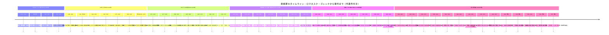

```mermaid
timeline
    title 芸術家のタイムライン：ロマネスク・ゴシックから現代まで（代表作付き）

    section ロマネスク・ゴシック期（約1000〜1400年）
        1120s - 1130s : ジスルベルトゥス（フランス／代表作：「最後の審判」、1130年頃／展示場所：オータン大聖堂）
        約1200年 : ヴィリギスのモザイク職人（神聖ローマ帝国／代表作：マインツ大聖堂の装飾、1200年頃／展示場所：現地）
        1240 - 1302 : アルノルフォ・ディ・カンビオ（イタリア／代表作：フィレンツェ大聖堂の設計、1296年）
        1267 - 1337 : ジョット・ディ・ボンドーネ（イタリア／代表作：スクロヴェーニ礼拝堂のフレスコ画、1305年頃）

    section ルネサンス（約1400〜1600年）
        1386 - 1466 : ドナテッロ（イタリア／代表作：「ダビデ像」、1440年頃／展示場所：バルジェロ国立博物館）
        1401 - 約1428 : マザッチョ（イタリア／代表作：「楽園追放」、1425年頃／展示場所：サンタ・マリア・デル・カルミネ教会）
        1445 - 1510 : サンドロ・ボッティチェリ（イタリア／代表作：「ヴィーナスの誕生」、1485年頃／展示場所：ウフィツィ美術館）
        1452 - 1519 : レオナルド・ダ・ヴィンチ（イタリア／代表作：「モナ・リザ」、1503年頃／展示場所：ルーヴル美術館）
        1475 - 1564 : ミケランジェロ・ブオナローティ（イタリア／代表作：「最後の審判」、1536〜1541年／展示場所：システィーナ礼拝堂）
        1483 - 1520 : ラファエロ・サンティ（イタリア／代表作：「アテネの学堂」、1509〜1511年／展示場所：バチカン美術館）
        約1488/1490 - 1576 : ティツィアーノ（イタリア／代表作：「ウルビーノのヴィーナス」、1538年／展示場所：ウフィツィ美術館）

    section バロック・ロココ期（約1600〜1750年）
        1571 - 1610 : カラヴァッジオ（イタリア／代表作：「聖マタイの召命」、1600年／展示場所：サン・ルイジ・デイ・フランチェージ教会）
        1577 - 1640 : ピーテル・パウル・ルーベンス（フランドル／代表作：「マリー・ド・メディシスの生涯」、1621〜1625年／展示場所：ルーヴル美術館）
        1599 - 1641 : アンソニー・ヴァン・ダイク（フランドル／代表作：「チャールズ1世の肖像」、1635年頃／展示場所：ナショナル・ギャラリー）
        1606 - 1669 : レンブラント・ファン・レイン（オランダ／代表作：「夜警」、1642年／展示場所：アムステルダム国立美術館）
        1632 - 1675 : ヨハネス・フェルメール（オランダ／代表作：「真珠の耳飾りの少女」、1665年頃／展示場所：マウリッツハイス美術館）
        1684 - 1721 : アントワーヌ・ヴァトー（フランス／代表作：「シテール島への出発」、1717年／展示場所：ルーヴル美術館）
        1703 - 1770 : ジャン＝バティスト＝シメオン・シャルダン（フランス／代表作：「食器棚の上の道具類」、1731年／展示場所：ルーヴル美術館）

    section 新古典主義・ロマン主義・写実主義（約1750〜1900年）
        1746 - 1828 : フランシスコ・ゴヤ（スペイン／代表作：「我が子を喰らうサトゥルヌス」、1819〜1823年／展示場所：プラド美術館）
        1748 - 1825 : ジャック＝ルイ・ダヴィッド（フランス／代表作：「マラーの死」、1793年／展示場所：ベルギー王立美術館）
        1760 - 1849 : 葛飾北斎（日本／代表作：「神奈川沖浪裏」、1831年／展示場所：ポーラ美術館、大英博物館）
        1791 - 1824 : テオドール・ジェリコー（フランス／代表作：「メデューズ号の筏」、1819年／展示場所：ルーヴル美術館）
        1798 - 1863 : ウジェーヌ・ドラクロワ（フランス／代表作：「民衆を導く自由の女神」、1830年／展示場所：ルーヴル美術館）
        1817 - 1878 : ジャン＝フランソワ・ミレー（フランス／代表作：「落穂拾い」、1857年／展示場所：オルセー美術館）
        1819 - 1877 : ギュスターヴ・クールベ（フランス／代表作：「石割り」、1849年／展示場所：ドレスデン美術館）

    section 印象派・ポスト印象派（約1860〜1900年代初頭）
        1832 - 1883 : エドゥアール・マネ（フランス／代表作：「草上の昼食」、1863年／展示場所：オルセー美術館）
        1834 - 1917 : エドガー・ドガ（フランス／代表作：「踊り子たち」、1874年／展示場所：オルセー美術館）
        1839 - 1906 : ポール・セザンヌ（フランス／代表作：「サント＝ヴィクトワール山」、1885年頃／展示場所：オルセー美術館）
        1840 - 1926 : クロード・モネ（フランス／代表作：「睡蓮」、1916年／展示場所：西洋美術館、オランジュリー美術館）
        1841 - 1919 : ピエール＝オーギュスト・ルノワール（フランス／代表作：「ムーラン・ド・ラ・ギャレットの舞踏会」、1876年／展示場所：オルセー美術館）
        1848 - 1903 : ポール・ゴーギャン（フランス／代表作：「浜辺のタヒチの女たち」、1891年／展示場所：オルセー美術館）
        1853 - 1890 : フィンセント・ファン・ゴッホ（オランダ／代表作：「星月夜」、1889年／展示場所：MoMA ニューヨーク近代美術館）

    section 近代〜現代美術（1900年〜現在）
        1866 - 1944 : ワシリー・カンディンスキー（ロシア／代表作：「コンポジションVII」、1913年／展示場所：トレチャコフ美術館）
        1869 - 1954 : アンリ・マティス（フランス／代表作：「ダンス」、1910年／展示場所：エルミタージュ美術館）
        1881 - 1973 : パブロ・ピカソ（スペイン／代表作：「ゲルニカ」、1937年／展示場所：ソフィア王妃芸術センター）
        1882 - 1963 : ジョルジュ・ブラック（フランス／代表作：「マンドリンを持つ女」、1910年／展示場所：国立西洋美術館）
        1887 - 1968 : マルセル・デュシャン（フランス／代表作：「泉」、1917年／展示場所：複数レプリカ）
        1893 - 1983 : ジョアン・ミロ（スペイン／代表作：「コンステレーション」シリーズ、1940年頃／展示場所：ミロ財団）
        1904 - 1989 : サルバドール・ダリ（スペイン／代表作：「記憶の固執」、1931年／展示場所：MoMA ニューヨーク近代美術館）
        1923 - 1997 : ロイ・リキテンスタイン（アメリカ／代表作：「ワァーム！」、1963年／展示場所：テート・モダン）
        1928 - 1987 : アンディ・ウォーホル（アメリカ／代表作：「マリリン・モンロー」、1962年／展示場所：MoMAなど）
        1929 - 現在 : 草間彌生（日本／代表作：「かぼちゃ」、1994年／展示場所：草間彌生美術館、ポーラ美術館）
        1932 - 現在 : ゲルハルト・リヒター（ドイツ／代表作：「アトラス」、1962年以降／展示場所：リヒター・アーカイブ）
        1936 - 2010 : 荒川修作（日本／代表作：「意味のメカニズム」、1984年／展示場所：豊島美術館）
        1936 - 現在 : 李禹煥（韓国／代表作：「関係項」シリーズ、1971年以降／展示場所：李禹煥美術館）
        1974 - 現在 : 青島千穂（日本／代表作：「青の風景」、2015年／展示場所：東京都現代美術館）
```
